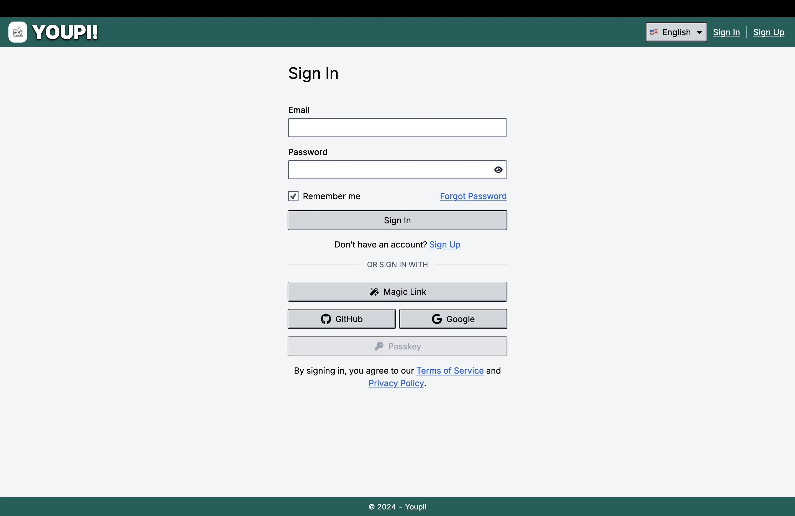
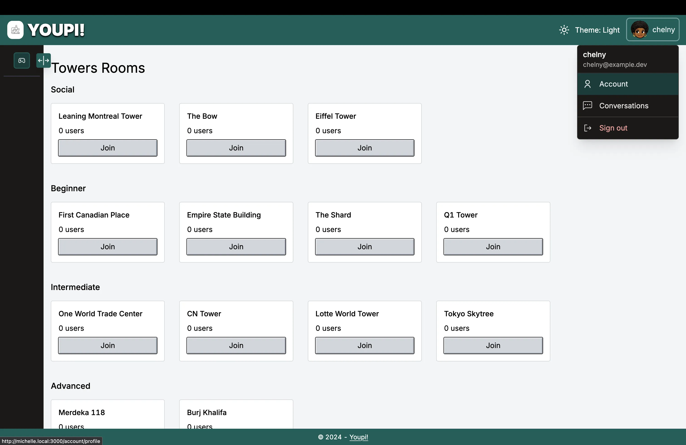
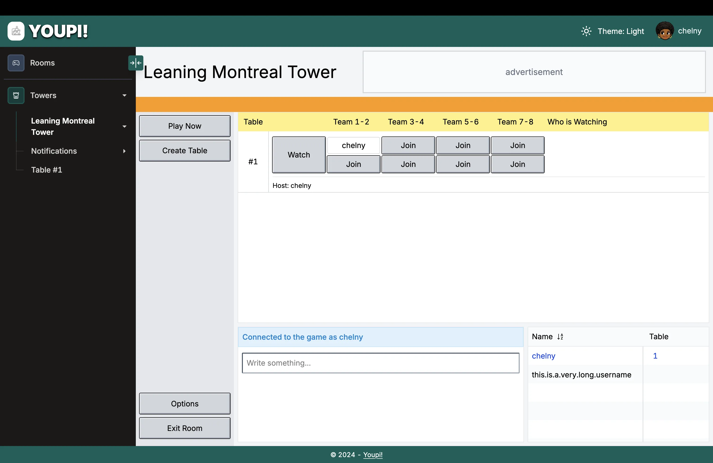
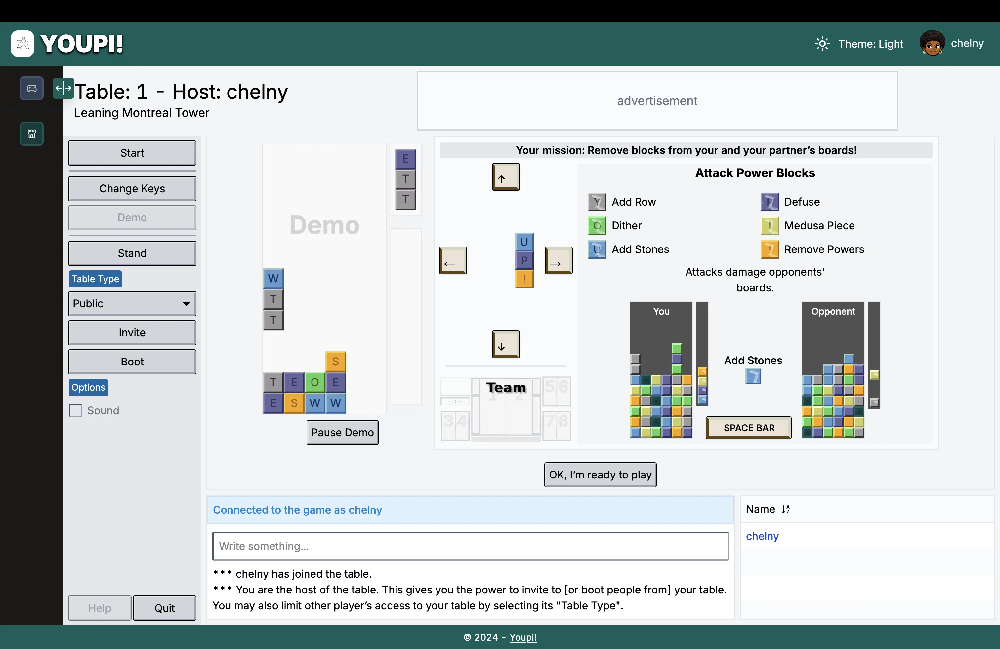
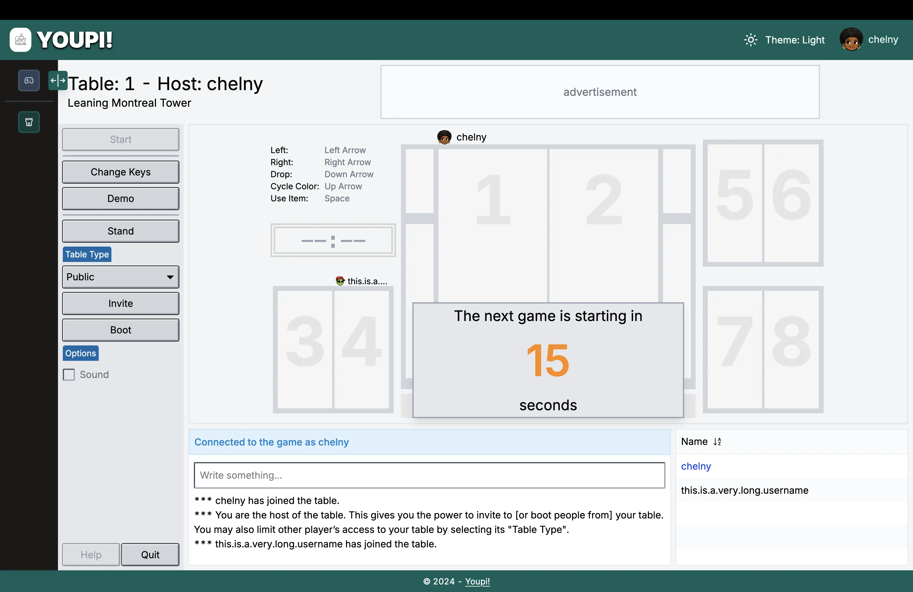
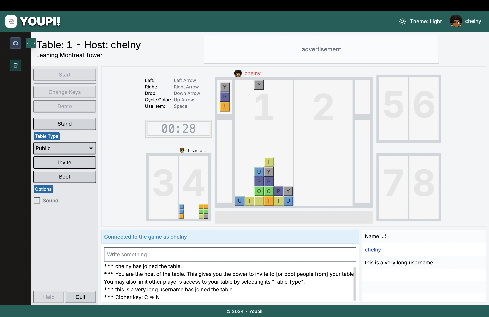
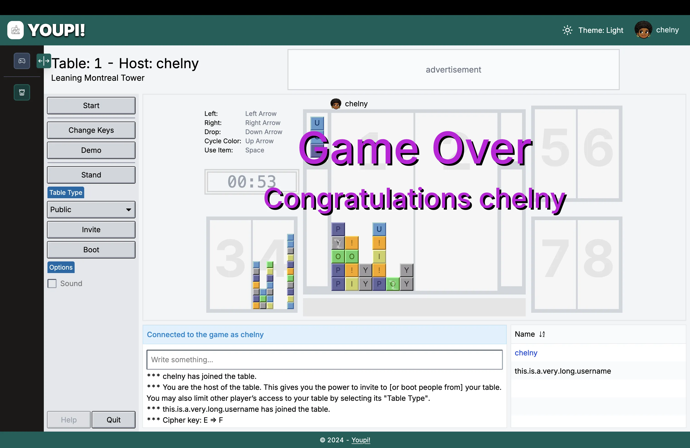
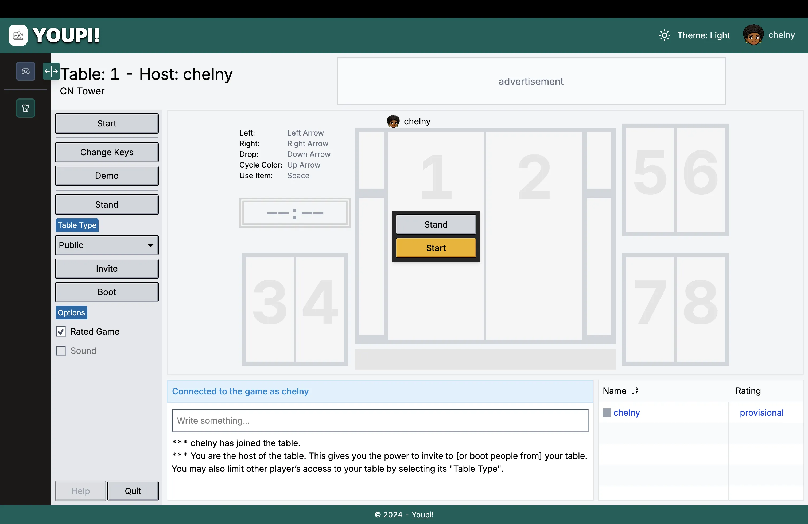

<a name="readme-top"></a>

[](https://github.com/Chelny/youpi/graphs/contributors)
[](https://github.com/Chelny/youpi/network/members)
[](https://github.com/Chelny/youpi/stargazers)
[](https://github.com/Chelny/youpi/issues)
[](https://github.com/Chelny/youpi/blob/master/LICENSE.txt)

<br />

<div align="center">
  <table width="100%" bgcolor="#00635E">
    <tr>
      <td align="center">
        
      </td>
    </tr>
  </table>

  <br />

  <h1 align="center" style="border-bottom: none;">Youpi!</h1>

  <p align="center">
    <del>View website</del>
    ·
    <a href="https://github.com/Chelny/youpi/issues/new?labels=bug&template=bug-report---.md">Report Bug</a>
    ·
    <a href="https://github.com/Chelny/youpi/issues/new?labels=enhancement&template=feature-request---.md">Request Feature</a>
  </p>
</div>

<br />

<details>
  <summary>Table of Contents</summary>
  <ol>
    <li>
      <a href="#about-the-project">About The Project</a>
      <ul style="padding-inline-start: 10px; margin: 0;">
        <li><a href="#built-with">Built With</a></li>
      </ul>
    </li>
    <li>
      <a href="#getting-started">Getting Started</a>
      <ul style="padding-inline-start: 10px; margin: 0;">
        <li><a href="#prerequisites">Prerequisites</a></li>
        <li><a href="#installation">Installation</a></li>
      </ul>
    </li>
    <li><a href="#usage">Usage</a></li>
    <li><a href="#screenshots-and-video">Screenshots and video</a></li>
    <li><a href="#roadmap">Roadmap</a></li>
    <li><a href="#license">License</a></li>
    <li><a href="#contact">Contact</a></li>
    <li><a href="#acknowledgments">Acknowledgments</a></li>
  </ol>
</details>

## About The Project

This project is inspired by Yahoo! Towers but is an independent work. It is not affiliated with or endorsed by Yahoo! or its entities. |

### Built With


<p align="right">(<a href="#readme-top">back to top</a>)</p>

## Getting Started

### Prerequisites

- Postgres
- pgAdmin
- pnpm
  ```sh
  npm install -g pnpm
  ```

### Installation

1. Clone the repository

   ```sh
   git clone git@github.com:Chelny/youpi.git
   cd youpi
   ```

1. Install dependencies

   ```sh
   pnpm install
   ```

1. Create and fill the .env file

   ```sh
   cp .env.example .env
   ```

1. Start Postgres server

1. Setup the database

   ```sh
   pnpm db:setup
   ```

   This will create the tables in database and add initial data such as rooms.

1. Run the client

   ```sh
   pnpm dev
   ```

   This command starts the development server, allowing you to access your application locally at http://localhost:3000.

<p align="end">(<a href="#readme-top">back to top</a>)</p>

## Usage

1. Open your browser and go to [http://localhost:3000](http://localhost:3000).

2. Sign in with an existing account or create a new one.

3. Browse the rooms and tables:
   - Click on a room to join it.
   - Inside a room, you can interact with other players and see available tables.

4. Playing the game:
   - Join a table to start a game.
   - Use the control keys (check the Control Keys screenshot) to play.
   - Watch the countdown and get ready to play.

<p align="end">(<a href="#readme-top">back to top</a>)</p>

## Screenshots and Video

| | | |
| :--: | :--: | :--: |
| [](public/images/readme/youpi-sign-in-page.webp) | [](public/images/readme/towers-rooms.webp) | [](public/images/readme/towers-social-room.webp) |
| [](public/images/readme/towers-social-room-demo.webp) | [](public/images/readme/towers-social-room-table-countdown.webp) | [](public/images/readme/towers-social-room-table-hoo.webp) |
| [](public/images/readme/towers-social-room-table-game-over.webp) | [](public/images/readme/towers-intermediate-room.webp) | [](public/images/readme/towers-intermediate-room-table-waiting.webp)

You can view the video of the Towers game [here](public/videos/readme-demo.mp4). The project is not fully working with the database and the game contain bugs.

<p align="end">(<a href="#readme-top">back to top</a>)</p>

## Roadmap

- [ ] Add tooltip component (?)
- [ ] User changing username while in room(s) and table(s)
  - [ ] Prevent user from accessing the profile page while in a game room (show prompt on click)
  - [ ] Send websocket event to all rooms and tables to update the username if changed

See the [open issues](https://github.com/Chelny/youpi/issues) for a full list of proposed features (and known issues).

<p align="end">(<a href="#readme-top">back to top</a>)</p>

## License

Distributed under the MIT License. See `LICENSE.txt` for more information.

<p align="end">(<a href="#readme-top">back to top</a>)</p>

## Contact

[](https://bsky.app/profile/chelny.bsky.social)
[](https://linkedin.com/in/chelny)
[](https://twitter.com/Chelny)

<p align="end">(<a href="#readme-top">back to top</a>)</p>

## Acknowledgments

- [Choose an Open Source License](https://choosealicense.com)
- [Flaticon](https://www.flaticon.com/)
- [Img Shields](https://shields.io/)
- [React Icons](https://react-icons.github.io/react-icons/)

<p align="end">(<a href="#readme-top">back to top</a>)</p>
